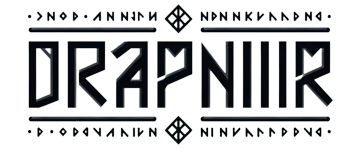

# Draupnir Design System

<div align="center">



**Um design system moderno e acessível construído com React, TypeScript e Tailwind CSS**

[](https://badge.fury.io/js/draupnir-ds)
[](https://opensource.org/licenses/ISC)
[](https://draupnir-ds.vercel.app)

[Documentação](https://draupnir-ds.vercel.app) • [Componentes](https://draupnir-ds.vercel.app/?path=/story/docs-introduction--page) • [Tokens](https://draupnir-ds.vercel.app/?path=/story/docs-colors--page)

</div>

---

## 🎯 Sobre o Projeto

O **Draupnir** é um design system inspirado no anel mágico da mitologia nórdica que se multiplicava, simbolizando a reutilização e escalabilidade dos componentes. Desenvolvido com foco em acessibilidade, performance e experiência do desenvolvedor.

### ✨ Características Principais

- 🎨 **Design Tokens**: Sistema completo de cores, tipografia, espaçamentos e sombras
- 🧩 **Atomic Design**: Organização hierárquica de componentes (Atoms, Molecules, Organisms)
- ♿ **Acessibilidade**: Componentes acessíveis com suporte a ARIA e navegação por teclado
- 🌙 **Temas**: Suporte nativo a temas claro/escuro
- 📱 **Responsivo**: Componentes adaptáveis a diferentes tamanhos de tela
- ⚡ **Performance**: Otimizado para performance com Tree Shaking
- 🔧 **TypeScript**: Tipagem forte em todo o projeto
- 📚 **Storybook**: Documentação interativa e exemplos práticos

## 🚀 Instalação

```bash
npm install draupnir-ds
```

ou

```bash
yarn add draupnir-ds
```

## 📖 Uso Básico

```tsx
import { Button, Input, Modal, useTheme } from 'draupnir-ds';

function App() {
  const { theme, toggleTheme } = useTheme();

  return (
    <div className="p-4">
      <Button onClick={toggleTheme}>
        Alternar Tema: {theme}
      </Button>
      
      <Input.Root>
        <Input.Control placeholder="Digite algo..." />
      </Input.Root>
    </div>
  );
}
```

## 🏗️ Estrutura do Projeto

```
src/
├── components/
│   ├── atoms/          # Componentes básicos (Button, Avatar, etc.)
│   ├── molecules/      # Combinações simples (Input, Switch, etc.)
│   ├── organisms/      # Componentes complexos (Modal, Dropdown, etc.)
│   └── templates/      # Layouts e estruturas de página
├── tokens/             # Design tokens (cores, tipografia, etc.)
├── utils/              # Utilitários e helpers
└── hooks/              # Hooks customizados
```

## 🎨 Design Tokens

### Cores

```tsx
import { colors } from 'draupnir-ds';

// Cores primárias
colors.primary[500]  // Verde principal
colors.secondary[500] // Verde secundário
colors.tertiary[500]  // Amarelo
colors.quaternary[500] // Vermelho

// Cores semânticas
colors.success[500]   // Verde de sucesso
colors.error[500]     // Vermelho de erro
colors.info[500]      // Azul informativo
colors.warning[500]   // Amarelo de aviso
```

### Tipografia

```tsx
import { typography } from 'draupnir-ds';

// Tamanhos de fonte
typography.fontSize.xs    // 12px
typography.fontSize.sm    // 14px
typography.fontSize.md    // 16px
typography.fontSize.lg    // 18px
typography.fontSize.xl    // 20px
typography.fontSize['2xl'] // 24px
typography.fontSize['4xl'] // 28px

// Títulos
typography.fontSize.tmd   // 40px
typography.fontSize.tlg   // 48px
typography.fontSize.txl   // 56px
```

### Espaçamentos

```tsx
import { spacing } from 'draupnir-ds';

spacing.xs    // 16px
spacing.sm    // 20px
spacing.md    // 24px
spacing.lg    // 32px
spacing.xl    // 40px
spacing['2xl'] // 48px
spacing['4xl'] // 56px
```

## 🧩 Componentes

### Atoms

Componentes básicos e fundamentais do design system.

```tsx
import { Button, Avatar, Badge, Box, Typography } from 'draupnir-ds';

// Botão com variantes
<Button variant="primary">Botão Primário</Button>
<Button variant="outline">Botão Outline</Button>
<Button variant="ghost">Botão Ghost</Button>

// Avatar com diferentes tamanhos
<Avatar size="sm" image="/avatar.jpg" />
<Avatar size="md" description="João Silva" />

// Badge para status
<Badge variant="success">Ativo</Badge>
<Badge variant="error">Inativo</Badge>

// Box para layouts
<Box filledBackground type="primary">
  Conteúdo do box
</Box>

// Tipografia
<Typography size="lg" weight="semibold">
  Título da página
</Typography>
```

### Molecules

Combinações simples de atoms com funcionalidades específicas.

```tsx
import { Input, Switch, Notice, Loading } from 'draupnir-ds';

// Input com prefixo
<Input.Root>
  <Input.Prefix>
    <SearchIcon />
  </Input.Prefix>
  <Input.Control placeholder="Buscar..." />
</Input.Root>

// Switch com variantes
<Switch variant="common" defaultEnable />
<Switch variant="contract" onChange={handleToggle} />

// Notice para mensagens
<Notice type="success" message="Operação realizada com sucesso!" />
<Notice type="error" message="Ocorreu um erro!" />

// Loading
<Loading />
```

### Organisms

Componentes complexos que combinam múltiplos molecules e atoms.

```tsx
import { Modal, Dropdown, TitlePage, SubtitlePage } from 'draupnir-ds';

// Modal com conteúdo
<Modal isOpen={isOpen} onClose={handleClose}>
  <ModalHeader>Título do Modal</ModalHeader>
  <ModalBody>
    <Typography>Conteúdo do modal...</Typography>
  </ModalBody>
  <ModalFooter>
    <Button variant="outline" onClick={handleClose}>Cancelar</Button>
    <Button onClick={handleConfirm}>Confirmar</Button>
  </ModalFooter>
</Modal>

// Dropdown
<Dropdown>
  <Dropdown.Trigger asChild>
    <Button variant="ghost">Abrir Menu</Button>
  </Dropdown.Trigger>
  <Dropdown.Content>
    <Dropdown.Item onSelect={() => console.log('Item 1')}>
      Item 1
    </Dropdown.Item>
    <Dropdown.Item onSelect={() => console.log('Item 2')}>
      Item 2
    </Dropdown.Item>
  </Dropdown.Content>
</Dropdown>

// Páginas
<TitlePage title="Dashboard" description="Bem-vindo ao seu painel" />
<SubtitlePage subtitle="Configurações" description="Gerencie suas preferências">
  <Button>Salvar</Button>
</SubtitlePage>
```

## 🎛️ Hooks

### useTheme

Gerencia o tema da aplicação (claro/escuro).

```tsx
import { useTheme, ThemeProvider } from 'draupnir-ds';

function App() {
  return (
    <ThemeProvider>
      <MyApp />
    </ThemeProvider>
  );
}

function MyApp() {
  const { theme, toggleTheme, setTheme } = useTheme();

  return (
    <div>
      <p>Tema atual: {theme}</p>
      <Button onClick={toggleTheme}>Alternar Tema</Button>
      <Button onClick={() => setTheme('dark')}>Forçar Escuro</Button>
    </div>
  );
}
```

### useLocalStorage

Gerencia dados no localStorage com estado React.

```tsx
import { useLocalStorage } from 'draupnir-ds';

function MyComponent() {
  const [user, setUser] = useLocalStorage('user', { name: '', email: '' });

  const updateUser = (newUser) => {
    setUser(newUser);
  };

  return (
    <div>
      <p>Usuário: {user.name}</p>
      <Input 
        value={user.name}
        onChange={(e) => setUser({ ...user, name: e.target.value })}
      />
    </div>
  );
}
```

## 🎨 Customização

### Configuração do Tailwind

```js
// tailwind.config.js
module.exports = {
  content: [
    './src/**/*.{js,ts,jsx,tsx}',
    './node_modules/draupnir-ds/**/*.{js,ts,jsx,tsx}',
  ],
  theme: {
    extend: {
      colors: {
        // Suas cores customizadas
        'custom-primary': '#your-color',
      },
    },
  },
  plugins: [],
};
```

### Variáveis CSS Customizadas

```css
:root {
  /* Sobrescrever tokens do design system */
  --primary: 22, 163, 74;
  --secondary: 76, 175, 80;
  --text-primary: 24, 24, 24;
}
```

## 📚 Documentação

- **[Storybook](https://draupnir-ds.vercel.app)**: Documentação interativa
- **[Componentes](https://draupnir-ds.vercel.app/?path=/story/docs-introduction--page)**: Guia de componentes
- **[Tokens](https://draupnir-ds.vercel.app/?path=/story/docs-colors--page)**: Design tokens
- **[Exemplos](https://draupnir-ds.vercel.app/?path=/story/docs-examples--page)**: Casos de uso

## 🛠️ Desenvolvimento

### Pré-requisitos

- Node.js 18+
- npm ou yarn

### Instalação

```bash
git clone https://github.com/Tonybsilva-dev/Draupnir.git
cd Draupnir
npm install
```

### Scripts Disponíveis

```bash
# Desenvolvimento
npm run dev              # Inicia o servidor de desenvolvimento
npm run storybook        # Inicia o Storybook
npm run build-storybook  # Build do Storybook

# Build e Deploy
npm run build            # Build da aplicação
npm run start            # Inicia o servidor de produção

# Qualidade de Código
npm run lint             # Executa o ESLint
npm run type-check       # Verifica tipos TypeScript
```

### Estrutura de Desenvolvimento

```
├── src/
│   ├── components/      # Componentes organizados por Atomic Design
│   ├── tokens/          # Design tokens
│   ├── utils/           # Utilitários
│   └── hooks/           # Hooks customizados
├── .storybook/          # Configuração do Storybook
├── public/              # Assets públicos
└── docs/                # Documentação adicional
```

## 🤝 Contribuição

1. Fork o projeto
2. Crie uma branch para sua feature (`git checkout -b feature/AmazingFeature`)
3. Commit suas mudanças (`git commit -m 'Add some AmazingFeature'`)
4. Push para a branch (`git push origin feature/AmazingFeature`)
5. Abra um Pull Request

### Diretrizes de Contribuição

- Siga o padrão de commits [Conventional Commits](https://www.conventionalcommits.org/)
- Mantenha a cobertura de testes acima de 80%
- Documente novos componentes no Storybook
- Siga as diretrizes de acessibilidade WCAG 2.1

## 📄 Licença

Este projeto está licenciado sob a licença ISC - veja o arquivo [LICENSE](LICENSE) para detalhes.

## 👨‍💻 Autor

**Antonio Bernardino da Silva**

- Email: contato@antoniobsilva.com.br
- GitHub: [@Tonybsilva-dev](https://github.com/Tonybsilva-dev)
- LinkedIn: [Antonio Bernardino](https://linkedin.com/in/antoniobsilva)

## 🙏 Agradecimentos

- [Rocketseat](https://rocketseat.com.br) pelo Andromeda Design System
- [Tailwind CSS](https://tailwindcss.com) pela framework de CSS
- [Radix UI](https://www.radix-ui.com) pelos componentes primitivos
- [Storybook](https://storybook.js.org) pela documentação interativa

---

<div align="center">

**Feito com ❤️ no Brasil**

[](https://github.com/Tonybsilva-dev/Draupnir)
[](https://github.com/Tonybsilva-dev/Draupnir)

</div> 